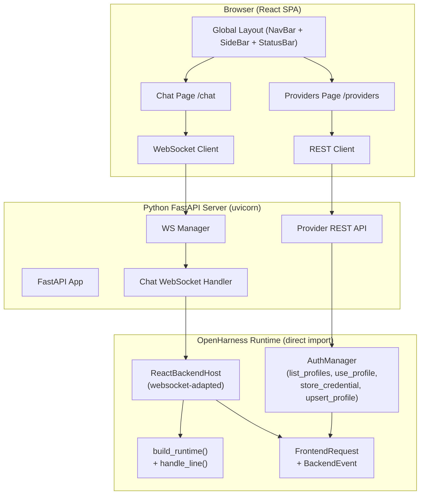

## P0 阶段目标

实现 OpenHarness WebUI 的三个 P0 核心页面：

1. **全局布局框架**：NavBar（顶部导航栏含Logo/模型选择器/设置入口）+ SideBar（左侧导航菜单）+ StatusBar（底部状态栏含提供者/MCP/模型/Token信息）
2. **对话页(/chat)**：WebSocket实时流式对话、消息列表渲染（用户/AI/工具消息）、斜杠命令输入框、工具调用可视化卡片、权限审批模态框
3. **提供者配置页(/providers)**：提供者配置文件列表（卡片展示状态/模型/认证信息）、新增/编辑/删除提供者、API密钥管理、切换活跃提供者

架构上后端直接import OpenHarness的Python模块（不走子进程），通过FastAPI + WebSocket暴露API。

## 技术栈

### 前端

- **React 18.3** + **TypeScript 5.7** — UI框架（与现有终端TUI同版本）
- **Vite 6** — 构建工具（HMR开发体验）
- **Tailwind CSS 4** — 原子化CSS，深色主题支持
- **React Router 7** — 前端路由
- **WebSocket (原生)** — 实时通信，无额外依赖
- **zustand** — 轻量状态管理
- **react-markdown** + **rehype-highlight** — Markdown渲染+代码高亮

### 后端

- **Python 3.10+** — 后端语言
- **FastAPI 0.115** — Web框架 + WebSocket原生支持
- **uvicorn** — ASGI服务器
- **Pydantic v2** — 数据验证（与OpenHarness一致）
- **OpenHarness运行时** — 直接import复用（AuthManager, RuntimeBundle, build_runtime, handle_line, StreamEvent等）

## 实现方案

### 1. 项目结构

```
webui/                             # 新建项目目录，与OpenHarness/同级
├── frontend/                      # React前端
│   ├── index.html
│   ├── package.json
│   ├── vite.config.ts
│   ├── tsconfig.json
│   ├── tsconfig.app.json
│   ├── tailwind.config.ts
│   └── src/
│       ├── main.tsx               # 入口
│       ├── App.tsx                # 路由+布局
│       ├── index.css              # Tailwind + 全局样式
│       ├── types/
│       │   └── protocol.ts        # 前后端协议类型（同步自OpenHarness protocol.py）
│       ├── stores/
│       │   ├── chatStore.ts       # 对话状态管理
│       │   └── providerStore.ts   # 提供者状态管理
│       ├── hooks/
│       │   └── useWebSocket.ts    # WebSocket连接+事件处理Hook
│       ├── components/
│       │   ├── layout/
│       │   │   ├── AppLayout.tsx
│       │   │   ├── NavBar.tsx
│       │   │   ├── SideBar.tsx
│       │   │   └── StatusBar.tsx
│       │   ├── chat/
│       │   │   ├── ChatPage.tsx
│       │   │   ├── MessageList.tsx
│       │   │   ├── MessageBubble.tsx
│       │   │   ├── ChatInput.tsx
│       │   │   ├── ToolCallCard.tsx
│       │   │   ├── PermissionModal.tsx
│       │   │   └── CommandPicker.tsx
│       │   ├── providers/
│       │   │   ├── ProvidersPage.tsx
│       │   │   ├── ProviderCard.tsx
│       │   │   └── ProviderFormModal.tsx
│       │   └── ui/
│       │       ├── Button.tsx
│       │       ├── Modal.tsx
│       │       ├── Input.tsx
│       │       ├── Select.tsx
│       │       ├── Toggle.tsx
│       │       ├── Badge.tsx
│       │       ├── Spinner.tsx
│       │       ├── Toast.tsx
│       │       └── Tooltip.tsx
│       └── lib/
│           └── utils.ts
│
└── backend/                       # Python FastAPI后端
    ├── main.py                    # FastAPI入口 + uvicorn启动
    ├── requirements.txt
    └── app/
        ├── __init__.py
        ├── ws_manager.py          # WebSocket连接管理器（多会话支持）
        ├── chat_handler.py        # 对话WebSocket处理器（封装ReactBackendHost）
        ├── providers.py           # 提供者管理REST API
        └── models.py              # 请求/响应Pydantic模型
```

### 2. 架构设计



### 3. 后端适配策略

**对话WebSocket处理器**：将OpenHarness现有的ReactBackendHost的stdin/stdout协议适配为WebSocket

```python
class WebSocketChatHost:
    """将ReactBackendHost的stdin/stdout管道通信改造为WebSocket"""

    def __init__(self, websocket: WebSocket):
        self._ws = websocket
        self._bundle: RuntimeBundle | None = None

    async def run(self):
        # 1. 构建OpenHarness运行时（直接调用build_runtime）
        self._bundle = await build_runtime(...)
        await start_runtime(self._bundle)
        # 2. 发送ready事件
        await self._ws.send_json(BackendEvent.ready(...))
        # 3. 事件循环：接收WebSocket消息 → 调用handle_line → 通过WebSocket发送BackendEvent
        while True:
            data = await self._ws.receive_json()
            request = FrontendRequest(**data)
            # 复用现有handle_line逻辑，将render_event回调改为ws.send_json
            should_continue = await handle_line(
                self._bundle, request.line,
                render_event=lambda event: self._emit(event),
                ...
            )
```

**核心复用逻辑**：

- 直接调用 `openharness.ui.runtime.build_runtime()` 构建 RuntimeBundle
- 直接调用 `openharness.ui.runtime.handle_line()` 处理用户输入
- 将 `render_event` 回调从 stdout 写入改为 `websocket.send_json()`
- `permission_prompt` 和 `ask_user_prompt` 通过 WebSocket 发送 modal_request 并等待响应
- 提供者API直接调用 `openharness.auth.manager.AuthManager`

### 4. 前后端API设计

#### WebSocket端（对话）

- 路径: `/ws/chat`
- 前端→后端: FrontendRequest JSON（submit_line, permission_response, question_response, interrupt, shutdown）
- 后端→前端: BackendEvent JSON（ready, transcript_item, assistant_delta, assistant_complete, tool_started, tool_completed, modal_request, line_complete, error）

#### REST API（提供者管理）

- `GET /api/providers` — 列出所有提供者配置文件及状态
- `POST /api/providers` — 新增提供者配置
- `PUT /api/providers/{name}` — 编辑提供者配置
- `DELETE /api/providers/{name}` — 删除提供者配置
- `POST /api/providers/{name}/use` — 切换活跃提供者
- `POST /api/providers/{name}/credential` — 存储API Key
- `DELETE /api/providers/{name}/credential` — 清除API Key

### 5. 关键数据结构（前端types/protocol.ts）

```typescript
// 完全同步自OpenHarness protocol.py + types.ts
export type TranscriptItem = {
  role: 'system' | 'user' | 'assistant' | 'tool' | 'tool_result' | 'log' | 'status';
  text: string;
  tool_name?: string;
  tool_input?: Record<string, unknown>;
  is_error?: boolean;
};

export type BackendEvent = {
  type: string;
  message?: string | null;
  item?: TranscriptItem | null;
  state?: Record<string, unknown> | null;
  tasks?: TaskSnapshot[] | null;
  commands?: string[] | null;
  modal?: Record<string, unknown> | null;
  tool_name?: string | null;
  tool_input?: Record<string, unknown> | null;
  output?: string | null;
  is_error?: boolean | null;
  // ... 其他字段
};

export type FrontendRequest = {
  type: 'submit_line' | 'permission_response' | 'question_response'
      | 'select_command' | 'apply_select_command' | 'interrupt' | 'shutdown';
  line?: string;
  command?: string;
  value?: string;
  request_id?: string;
  allowed?: boolean;
  answer?: string;
};
```

### 6. 状态管理

**chatStore (zustand)**:

```typescript
interface ChatState {
  transcript: TranscriptItem[];
  assistantBuffer: string;
  status: Record<string, unknown>;   // 模型/提供者/认证状态
  commands: string[];
  modal: Record<string, unknown> | null;
  busy: boolean;
  ready: boolean;
  sessionId: string | null;
  // actions
  connect: (url: string) => void;
  sendMessage: (text: string) => void;
  sendPermissionResponse: (id: string, allowed: boolean) => void;
  disconnect: () => void;
}
```

**providerStore (zustand)**:

```typescript
interface ProviderState {
  profiles: ProviderProfile[];
  activeProfile: string | null;
  loading: boolean;
  // actions
  fetchProfiles: () => Promise<void>;
  createProfile: (data) => Promise<void>;
  updateProfile: (name, data) => Promise<void>;
  deleteProfile: (name) => Promise<void>;
  switchProfile: (name) => Promise<void>;
  saveCredential: (name, key) => Promise<void>;
}
```

### 7. 设计要点

- **深色主题为主**：背景 #0F1117，卡片 #1A1D27，主色 #2563EB
- **Tailwind dark mode**：使用 `class` 策略，默认 `dark` class
- **三栏布局**：左侧栏 200px 可折叠 + 中间 main flex-1 + 右侧面板 280px 可折叠
- **WebSocket重连**：断线后3秒自动重连，指数退避
- **消息流式渲染**：assistant_delta 以50ms/384字符节流更新UI
- **工具调用卡片**：折叠态显示工具名+耗时+状态，展开态显示输入JSON+输出文本
- **斜杠命令补全**：输入 `/` 触发下拉过滤列表

### 8. 性能与可维护性

- **消息列表虚拟化**：仅渲染最近50条消息（防性能退化）
- **状态更新防抖**：state_snapshot/tasks_snapshot 在500ms内去重
- **WebSocket心跳**：每30秒ping保持连接
- **Zustand选择性订阅**：避免不必要的全量重渲染

## 设计风格

采用深色主题为主的现代化设计，参考CodeBuddy WebUI风格。全局布局为三栏式：左侧导航栏（200px可折叠）、中间主内容区（flex-1）、右侧上下文面板（280px可选）。顶部NavBar包含Logo、搜索、模型选择器和入口按钮。底部StatusBar显示提供者状态、MCP连接状态、当前模型和Token用量。

色彩以深蓝色(#0F1117)为背景基色，蓝色(#2563EB)为主色调，卡片使用#1A1D27二级背景色。所有UI组件采用圆角8px设计，适度的阴影层次。

对话页采用消息气泡设计：用户消息右对齐蓝色气泡，AI回复左对齐灰色气泡含Markdown渲染。工具调用以折叠卡片展示。输入框支持斜杠命令自动补全。

提供者配置页采用卡片列表+模态表单设计，每个提供者以独立卡片展示名称、模型、认证状态、提供者类型，状态指示灯（绿/黄/红）直观显示配置状态。