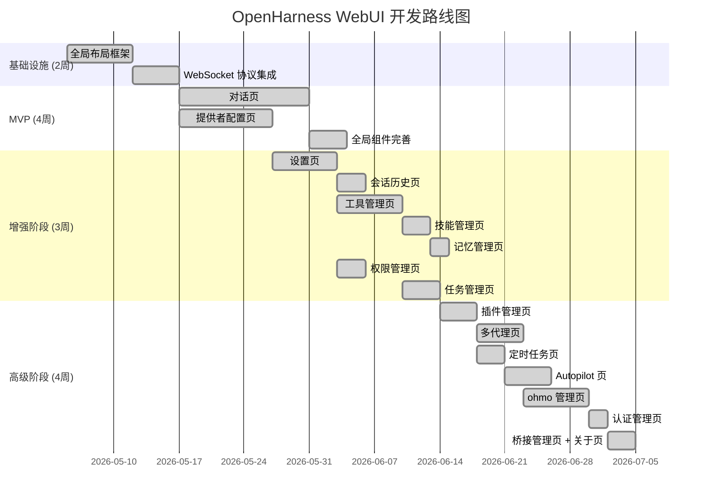

# OpenHarness WebUI 开发页面列表

> **版本**: v0.1.0  
> **基于**: 需求规格说明文档 + CLI 功能比对报告  
> **总页面数**: 18 个页面 + 3 个全局组件  
> **推荐开发顺序**: 按优先级 P0 → P1 → P2 分阶段推进

---

## 一、开发阶段与优先级说明

| 阶段 | 优先级 | 目标 | 页面数 | 预计工时 |
|------|--------|------|--------|---------|
| **MVP** | P0 | 可用的核心对话体验 | 3 大页面 + 全局布局 | 4-6 周 |
| **增强** | P1 | 配置管理全覆盖 | 7 个页面 | 3-4 周 |
| **高级** | P2 | 高级功能交付 | 8 个页面 | 4-6 周 |

---

## 二、页面列表

### Phase 1: MVP (P0) — 核心对话体验

#### 1. 对话页 (`/chat`)
| 项目 | 说明 |
|------|------|
| **对应 CLI** | `oh`（交互式会话） |
| **核心功能** | 消息流式对话、工具调用可视化卡片、斜杠命令补全、权限审批模态框、对话中断 |
| **子组件** | 消息列表、输入框、命令下拉面板、工具调用卡片、权限对话框、欢迎横幅 |
| **后端协议** | WebSocket 传输 `FrontendRequest` / `BackendEvent` |
| **依赖** | 全局布局（NavBar + StatusBar） |
| **复杂度** | ⭐⭐⭐⭐⭐ |

#### 2. 全局布局框架
| 项目 | 说明 |
|------|------|
| **对应 CLI** | 无（Web 特有） |
| **核心功能** | NavBar（Logo + 模型选择器 + 设置入口）、左侧导航栏、右侧上下文面板、底部状态栏 |
| **子组件** | ModelSelector、NavBar、SideBar、StatusBar、RightPanel |
| **依赖** | 无（基础设施） |
| **复杂度** | ⭐⭐⭐⭐ |

#### 3. 提供者配置页 (`/providers`)
| 项目 | 说明 |
|------|------|
| **对应 CLI** | `oh provider`、`oh auth`、`oh setup` |
| **核心功能** | 提供者卡片列表、新增/编辑模态表单（含全部字段）、切换活跃提供者、认证配置（API Key/OAuth）、模型选择 |
| **子组件** | ProviderCard、ProviderFormModal、ModelSelect、AuthStatusBadge |
| **后端协议** | REST API CRUD |
| **依赖** | 全局布局 |
| **复杂度** | ⭐⭐⭐⭐⭐ |

---

### Phase 2: 增强 (P1) — 配置管理全覆盖

#### 4. 会话历史页 (`/sessions`)
| 项目 | 说明 |
|------|------|
| **对应 CLI** | `/resume`、`/session`、`/tag`、`-c`/`--continue`、`-r`/`--resume` |
| **核心功能** | 历史会话列表（时间/摘要/消息数排序）、搜索过滤、恢复会话、标记快照、删除会话 |
| **后端协议** | REST API |
| **依赖** | 全局布局 |
| **复杂度** | ⭐⭐⭐ |

#### 5. 设置页 (`/settings`)
| 项目 | 说明 |
|------|------|
| **对应 CLI** | `/theme`、`/fast`、`/effort`、`/passes`、`/turns`、`/output-style`、`/config`、`/doctor`、`--bare`、`-s`/`--system-prompt` |
| **核心功能** | 通用设置（Effort/Passes/Turns/Fast/自动压缩）、主题选择器（卡片预览）、快捷键绑定表格、输出样式选择、Vim/语音模式开关、高级设置（调试模式/最小模式）、系统提示词编辑器、环境诊断面板 |
| **子组件** | EffortSelector、PassSlider、TurnsDropdown、ThemeCardGrid、KeybindTable、ToggleSwitch、OutputStyleSelect |
| **后端协议** | WebSocket + REST |
| **依赖** | 全局布局 |
| **复杂度** | ⭐⭐⭐⭐ |

#### 6. 工具管理页 (`/tools`)
| 项目 | 说明 |
|------|------|
| **对应 CLI** | `/mcp`、`oh mcp`、工具注册表、`--dry-run`、`--mcp-config` |
| **核心功能** | 工具分类导航树、工具 Schema 表格（名称/描述/参数）、MCP 服务器管理面板（列表/添加/删除/状态）、工具调用实时日志列表、Dry-run 预览按钮 |
| **子组件** | ToolCategoryNav、ToolSchemaTable、McpServerCard、McpAddForm、ToolLogTable、DryRunPreview |
| **后端协议** | REST API + WebSocket 实时推送 |
| **依赖** | 全局布局 |
| **复杂度** | ⭐⭐⭐⭐ |

#### 7. 技能管理页 (`/skills`)
| 项目 | 说明 |
|------|------|
| **对应 CLI** | `/skills`、Skill 工具 |
| **核心功能** | 技能卡片网格（名称/描述/来源）、启用/禁用切换开关、技能详情查看（Markdown 渲染）、安装 `.md` 技能文件（上传/拖拽） |
| **子组件** | SkillCardGrid、SkillDetailPanel、SkillUploadZone |
| **后端协议** | REST API |
| **依赖** | 全局布局 |
| **复杂度** | ⭐⭐⭐ |

#### 8. 记忆管理页 (`/memory`)
| 项目 | 说明 |
|------|------|
| **对应 CLI** | `/memory`、`ohmo memory` |
| **核心功能** | 记忆条目列表、添加/编辑/删除记忆、记忆搜索过滤、记忆详情（Markdown 查看） |
| **后端协议** | REST API |
| **依赖** | 全局布局 |
| **复杂度** | ⭐⭐ |

#### 9. 权限管理页 (`/permissions`)
| 项目 | 说明 |
|------|------|
| **对应 CLI** | `/permissions`、`--permission-mode`、`--allowed-tools`、`--disallowed-tools` |
| **核心功能** | 权限模式切换（Default/Plan/Auto 三选一卡片）、路径级权限规则表格（模式/路径/允许/拒绝）、命令黑名单编辑器、工具黑白名单表格 |
| **子组件** | PermissionModeCards、PathRuleTable、DenyCommandEditor、ToolAllowDenyTable |
| **后端协议** | REST API |
| **依赖** | 全局布局 |
| **复杂度** | ⭐⭐⭐ |

#### 10. 任务管理页 (`/tasks`)
| 项目 | 说明 |
|------|------|
| **对应 CLI** | `/tasks`、TaskCreate/Get/List/Update/Stop/Output 工具 |
| **核心功能** | 任务列表表格（ID/类型/状态/描述/元数据）、任务状态实时更新（WebSocket）、查看输出、停止任务、创建任务 |
| **子组件** | TaskTable、TaskDetailDrawer、TaskCreateForm |
| **后端协议** | REST API + WebSocket 实时推送 |
| **依赖** | 全局布局 |
| **复杂度** | ⭐⭐⭐ |

---

### Phase 3: 高级 (P2) — 高级功能交付

#### 11. 插件管理页 (`/plugins`)
| 项目 | 说明 |
|------|------|
| **对应 CLI** | `oh plugin`、`/plugin`、`/plugins` |
| **核心功能** | 插件列表（名称/版本/描述/启用态）、安装/卸载/启用/禁用、插件详情（命令/钩子/代理/MCP 列表） |
| **后端协议** | REST API |
| **依赖** | 全局布局 |
| **复杂度** | ⭐⭐⭐ |

#### 12. 多代理协作页 (`/swarm`)
| 项目 | 说明 |
|------|------|
| **对应 CLI** | `/agents`、`/subagents`、Agent/SendMessage/TeamCreate/TeamDelete 工具、Worktree 工具 |
| **核心功能** | 队友状态卡片网格（名称/状态/持续时间/当前任务）、团队创建/删除操作、消息通知流时间线、工作树管理 |
| **子组件** | SwarmTeammateCard、TeamCreateForm、NotificationTimeline、WorktreePanel |
| **后端协议** | WebSocket 实时推送 swarm_status 事件 |
| **依赖** | 全局布局 |
| **复杂度** | ⭐⭐⭐⭐ |

#### 13. 定时任务页 (`/cron`)
| 项目 | 说明 |
|------|------|
| **对应 CLI** | `oh cron`、CronCreate/Delete/List/Toggle 工具 |
| **核心功能** | Cron 调度器启停控制、作业列表表格（名称/计划/状态/上次执行）、作业启用/禁用开关、新建/编辑作业表单、执行历史与日志查看 |
| **子组件** | SchedulerControl、CronJobTable、CronJobForm、HistoryTimeline |
| **后端协议** | REST API |
| **依赖** | 全局布局 |
| **复杂度** | ⭐⭐⭐ |

#### 14. Autopilot 页 (`/autopilot`)
| 项目 | 说明 |
|------|------|
| **对应 CLI** | `oh autopilot`（10 个子命令） |
| **核心功能** | 状态仪表板（指标卡片）、条目列表、添加条目表单、上下文查看、日志面板、仓库扫描按钮、执行控制（run-next/tick）、Cron 安装、仪表板导出 |
| **后端协议** | REST API |
| **依赖** | 全局布局 |
| **复杂度** | ⭐⭐⭐⭐ |

#### 15. ohmo 管理页 (`/ohmo`)
| 项目 | 说明 |
|------|------|
| **对应 CLI** | `ohmo init` / `ohmo config` / `ohmo gateway` / `ohmo memory` / `ohmo soul` / `ohmo user` / `ohmo doctor` |
| **核心功能** | 工作区概览（路径/文件列表）、频道配置向导（Telegram/Slack/Discord/飞书 分步表单）、网关管理面板（启动/停止/重启/状态）、Soul.md 编辑器、User.md 编辑器、记忆管理、环境健康检查 |
| **子组件** | ChannelConfigWizard、GatewayControlPanel、SoulEditor、UserEditor、HealthCheckPanel |
| **后端协议** | REST API + 子进程管理 |
| **依赖** | 全局布局 |
| **复杂度** | ⭐⭐⭐⭐⭐ |

#### 16. 认证管理页 (`/auth`)
| 项目 | 说明 |
|------|------|
| **对应 CLI** | `oh auth`（8 个子命令） |
| **核心功能** | 认证源状态表格（源/状态/来源）、提供者配置文件状态表格、快速认证操作（Copilot 登录/Codex 绑定/Claude 绑定/登出） |
| **子组件** | AuthSourceTable、ProfileStatusTable、QuickAuthButton |
| **后端协议** | REST API |
| **依赖** | 全局布局 |
| **复杂度** | ⭐⭐ |

> **说明**: 认证管理页可与提供者配置页合并，作为提供者页的「认证」Tab 或展开面板

#### 17. 桥接管理页 (`/bridge`) [新增]
| 项目 | 说明 |
|------|------|
| **对应 CLI** | `/bridge`（新增自比对报告） |
| **核心功能** | 桥接会话列表、IDE 连接状态、启动/停止桥接会话 |
| **后端协议** | REST API |
| **依赖** | 全局布局 |
| **复杂度** | ⭐⭐ |

> **新增原因**: 比对报告发现 `/bridge` 斜杠命令在 CLI 中已存在但需求文档未覆盖

#### 18. 反馈与关于页 (`/about`)
| 项目 | 说明 |
|------|------|
| **对应 CLI** | `/feedback`、`/release-notes`、`/upgrade`、`/version`（新增自比对报告） |
| **核心功能** | 版本信息、发布说明、升级指引、反馈提交表单、隐私设置区域、速率限制提示 |
| **后端协议** | REST API（反馈提交） |
| **依赖** | 全局布局 |
| **复杂度** | ⭐⭐ |

---

## 三、全局共享组件

下列组件为多个页面共用，建议在框架阶段一并开发：

| 组件 | 用途 | 使用页面 | 复杂度 |
|------|------|---------|--------|
| **NavBar** | 顶部导航栏（Logo、搜索、模型选择器、设置入口、用户菜单） | 所有页面 | ⭐⭐⭐ |
| **SideBar** | 左侧导航菜单（可折叠/图标模式） | 所有页面 | ⭐⭐ |
| **StatusBar** | 底部状态栏（提供者/MCP/模型/Token） | 所有页面 | ⭐⭐ |
| **RightPanel** | 右侧上下文面板（会话信息、技能、MCP、Todo、Swarm） | `/chat` | ⭐⭐⭐ |
| **PermissionModal** | 权限审批模态对话框 | `/chat` | ⭐⭐ |
| **Toast** | 全局消息通知 | 所有页面 | ⭐ |
| **ModelSelector** | 顶部模型选择下拉 | 所有页面 | ⭐⭐ |

---

## 四、开发路线图建议



---

## 五、页面依赖关系

```
全局布局框架 ──────────┬─────────────────────────────────────
                      │
              ┌───────┴───────────┐
              │  ModelSelector    │
              │  PermissionModal  │
              │  Toast            │
              └───────────────────┘
                      │
    ┌─────────────────┼──────────────────────┐
    │                 │                      │
 对话页            提供者页             设置页
    │                 │                      │
    │           ┌─────┴─────┐          ┌─────┴──────┐
    │           │ 认证页     │          │ 会话历史页  │
    │           │           │          │            │
    │           │ 关于页     │          │ 桥接管理页  │
    │           └───────────┘          └────────────┘
    │
    ├── 工具管理页 ──┬── 技能管理页
    │               └── 任务管理页
    │
    ├── 权限管理页
    │
    ├── 插件管理页 ──┬── 多代理页
    │               └── 定时任务页
    │
    ├── Autopilot 页
    │
    └── 记忆管理页
         │
         └── ohmo 管理页（独立，可能单独部署）
```

---

## 六、汇总统计

| 指标 | 数量 |
|------|------|
| 总页面数 | 18 |
| P0 页面（MVP） | 3（全局布局 + 对话页 + 提供者页） |
| P1 页面（增强） | 7 |
| P2 页面（高级） | 8 |
| 全局共享组件 | 7 |
| 独立子组件 | ~35+ |
| 后端 REST 端点 | ~30+ |
| WebSocket 事件类型 | 前端 → 后端: ~13, 后端 → 前端: ~22 |
